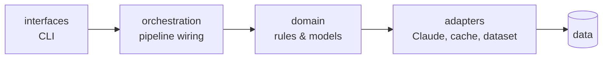

# hiver-support-agent


An AI customer-support agent, built on the [Customer Support on Twitter](https://www.kaggle.com/datasets/thoughtvector/customer-support-on-twitter) dataset, for one brand: **SpotifyCares**.

It does three things.

1. **Classifies** an incoming message into an intent I defined myself.
2. **Drafts a reply**, grounded in how SpotifyCares actually resolved similar issues before.
3. **Decides** whether to auto-handle it or hand it to a person, and says why.

The reasoning behind every choice here is in [DECISIONS.md](DECISIONS.md). Whether any of it actually works is in [REPORT.md](REPORT.md).

### At a glance

| | |
|---|---|
| Golden set | 200 hand-labeled examples, plus a 40-example held-out set that was never used to tune anything |
| Systems compared | the full agent, against a keyword baseline and an ungrounded zero-shot baseline |
| Escalation policy | had a real blind spot. Found it, fixed it. Escalate kappa went 0.099 → 0.417, confirmed on held-out data |
| Judge quality | checked against a real human rating, not assumed. Correlation 0.41, three concrete disagreements found and explained |

The full story, the tables, and the honest caveats are all in [REPORT.md](REPORT.md).

### Contents

[Quick start](#quick-start) · [Why SpotifyCares](#why-spotifycares) · [Architecture](#architecture) · [Setup](#setup) · [Dataset](#dataset) · [Running the pipeline](#running-the-pipeline) · [Reproducing the eval results](#reproducing-the-eval-results) · [Checking the numbers themselves](#checking-the-numbers-themselves) · [Development](#development)

## Quick start

The fastest way to see it do something:

```bash
python -m venv .venv && .venv/Scripts/activate   # .venv/bin/activate on macOS/Linux
pip install -e ".[dev]"
cp .env.example .env        # then edit it, add your ANTHROPIC_API_KEY
python -m interfaces.cli classify "I can't log into my account, help!"
```

That's classification on its own, no dataset needed. For the full pipeline, and the eval results behind REPORT.md, keep reading. [Dataset](#dataset) and [Reproducing the eval results](#reproducing-the-eval-results) matter most.

## Why SpotifyCares

Most brands in this dataset are ISPs or telecoms. Almost every ticket there is some version of "the internet is down." Spotify is one product, so the problems people bring to it are actually different from each other: billing disputes, playback bugs, account access, people threatening to cancel. That variety is what makes the failure analysis worth reading. The full reasoning is in [DECISIONS.md](DECISIONS.md).

## Architecture

One direction, no shortcuts.



The domain layer, `src/domain/`, doesn't know Claude exists. No SDK imports, no file paths, no model names in there, just the rules of the problem. Everything that touches the outside world, the LLM, the dataset, the disk, sits behind adapter interfaces the domain defines, and gets wired in at the composition root. That split is why the business logic can be tested without hitting a real API, and why swapping Claude for something else wouldn't touch anything upstream.

```
src/
  interfaces/     CLI entry point
  orchestration/  pipeline wiring
  domain/         models, intents, escalation rules, metrics (pure, no side effects)
  adapters/       Claude API, dataset loading, response caching
  config/         typed settings
eval/             labeling tools, LLM-judge, human/judge agreement stats, bootstrap CIs
tests/            metric computation, escalation rules, agreement stats
data/
  raw/            full Kaggle dataset (gitignored)
  subsample/      fixed-seed working subsample (gitignored)
  golden/         hand-labeled eval sets (committed, these are deliverables)
```

## Setup

You'll need Python 3.12 or newer.

```bash
python -m venv .venv
.venv/Scripts/activate   # .venv/bin/activate on macOS/Linux
pip install -e ".[dev]"
```

That installs `anthropic`, `pydantic`, `pandas`, `numpy`, and `click` to run, plus `ruff`, `mypy`, and `pytest` for development.

You'll need an Anthropic API key before anything that calls Claude will work.

```bash
cp .env.example .env
# edit .env and set ANTHROPIC_API_KEY=sk-ant-...
```

`Settings.from_env()` loads `.env` automatically. One thing to know: it won't override a key already sitting in your shell environment. If you exported one before and something seems off, `unset ANTHROPIC_API_KEY` first, so `.env` actually wins.

## Dataset

The full `twcs.csv` from Kaggle belongs at `data/raw/archive/twcs/twcs.csv`. It isn't committed, 2.81 million rows across every brand in the dataset, too big for git.

From that, `data/subsample/spotifycares_subsample.csv` is a smaller, fixed-seed slice scoped to SpotifyCares.

- Filtered down to the 28,280 conversations that contain at least one SpotifyCares reply. A "conversation" here is the whole connected thread, not just one back-and-forth pair.
- Sampled to **1,000 conversations, seed 42**. See [DECISIONS.md](DECISIONS.md) if you want the reasoning behind that number.
- Gitignored, so you'll need to build it yourself.

```bash
python scripts/build_subsample.py
```

Takes about 30 seconds, one pass over the raw CSV. This is the actual script behind the subsample, so running it is what makes everything below reproducible from a clean clone, instead of quietly depending on a file that only exists on my machine.

`data/golden/golden_set.csv` is the hand-labeled evaluation set, 200 examples of intent, escalate, and notes, and it's committed because it's a real deliverable. The customer's message is stored inline, so it doesn't need the subsample to exist. Only the reply-grounding lookup does.

**How it was built.** 200 conversations, pulled uniformly at random from the 1,000-conversation subsample, `random.Random(42).sample(...)`, no stratification, just a plain random draw. Large enough to sit comfortably in the assignment's 150 to 250 range without hand-labeling the whole subsample. I labeled all of them myself, through `eval/labeling_tool.py`, a small interactive CLI that shows only the customer's opening message, never the brand's actual historical reply. That's on purpose. The escalate judgment shouldn't be anchored on what SpotifyCares happened to do at the time. Each example gets an intent, an escalate yes or no, and optional notes. The tool remembers what's already labeled, so you can stop halfway through and come back to it later without redoing anything.

There's also `data/golden/holdout_set.csv`, a second, smaller set, 40 examples, sampled disjoint from the first one. It exists to check that a mid-project fix to the escalation policy actually generalizes, rather than just fitting the 200 examples that inspired it. More on that in REPORT.md.

## Running the pipeline

```bash
# Classify a single ad-hoc message
python -m interfaces.cli classify "I can't log into my account, help!"

# Run classify -> draft -> escalate end-to-end over N seeded subsample conversations
python -m interfaces.cli run --count 3 --precedent-pool-size 20
```

Both need the subsample built, see [Dataset](#dataset), and a working API key in `.env`. Every call gets cached by content hash, so running the same thing twice costs nothing the second time.

## Reproducing the eval results

```bash
# Cheap smoke test first, confirms the wiring works before you spend real money
python -m eval.run_eval --limit 5

# Full run: all three systems (full agent, baseline 1, baseline 2) against the golden set
python -m eval.run_eval
```

This writes `data/eval/{full_agent,baseline1,baseline2}.csv`, one row per example, plus `*_failures.csv` for anything that failed and got excluded instead of silently miscounted. REPORT.md was written straight from these files. Nothing in it is hand-typed or eyeballed. A full run of 200 examples costs a small slice of the $5 Anthropic minimum top-up, details in DECISIONS.md. Classification is cached and shared between the full agent and baseline 2, so most of the actual spend is the one-time precedent build, plus the Sonnet drafting and judging calls.

<details>
<summary><strong>Rough timing, if you're wondering whether this fits under 15 minutes</strong></summary>

<br>

From a clean clone with an empty cache: `pip install` takes a minute or two, `scripts/build_subsample.py` takes about 30 seconds, and the full eval run, roughly 1,050 LLM calls total once you account for cache-sharing, running 8 at a time, takes somewhere around 4 to 6 minutes. That lands comfortably under 15 minutes. It's a reasoned estimate from the actual call counts and concurrency, not something clocked on a truly cold cache. My own `data/cache/` is warm from building this thing. If you want a faster gut check before committing to the full run, `--limit 5` gets you there in seconds.

</details>

Want to see whether the fix I made to the escalation policy midway through this project actually holds up on data it never saw? That's what `eval/label_holdout.py` and `--golden-path` on `eval/run_eval.py` are for.

```bash
# Label a fresh 40-example holdout set, disjoint from golden_set.csv
python -m eval.label_holdout

# Evaluate against it separately, so it never overwrites the main results
python -m eval.run_eval --golden-path data/golden/holdout_set.csv --results-dir data/eval/holdout
```

## Checking the numbers themselves

Two more tools worth knowing about. Both exist because a headline number on its own isn't worth much without something to back it up.

`eval/bootstrap_ci.py` puts a confidence interval around the key kappa scores, so you can tell a real improvement from a number that just moved because of which 200 examples happened to get sampled.

```bash
python -m eval.bootstrap_ci
```

`eval/rate_replies.py` handles something the golden set can't: whether the LLM judge's reply-quality score actually means anything to a person. There's no ground-truth quality label in the golden set, by design, rating your own drafts against a message you already saw would anchor the judgment. So this samples real replies, hides the judge's score, and asks you to rate them cold.

```bash
# Rate a random sample of full-agent replies 1-5, blind to the judge's own score
python -m eval.rate_replies rate --count 30

# See how well your ratings agree with the judge's
python -m eval.rate_replies report
```

Both save progress as you go, `data/eval/human_reply_ratings.csv`, gitignored, so you can stop and resume freely.

## Development

```bash
ruff check .
ruff format --check .
mypy src eval tests
pytest
```
